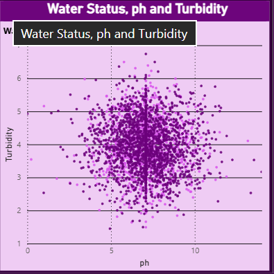

# 💧 Water Potability Dashboard (Power BI)

## 📌 Overview

This project analyzes water quality data to determine whether water is safe for drinking using Power BI.

---

## 🎯 Objectives

* Analyze water dataset
* Identify safe vs unsafe samples
* Study pH distribution
* Understand pH vs turbidity

---

## 📊 Dashboard Preview

---

## 📈 Key Insights

* ~61% of samples are unsafe
* Most pH values lie between 5–8
* No strong relationship between pH and turbidity

---

## 📷 Visualizations

### Water Status Distribution

### pH vs Turbidity

### pH Distribution

---

## 📁 Dataset

Contains:

* pH
* Hardness
* Solids
* Chloramines
* Sulfate
* Conductivity
* Organic Carbon
* Turbidity
* Potability

---

## 🛠 Tools Used

* Power BI
* CSV Dataset

---

## 🙌 Author

Appu
