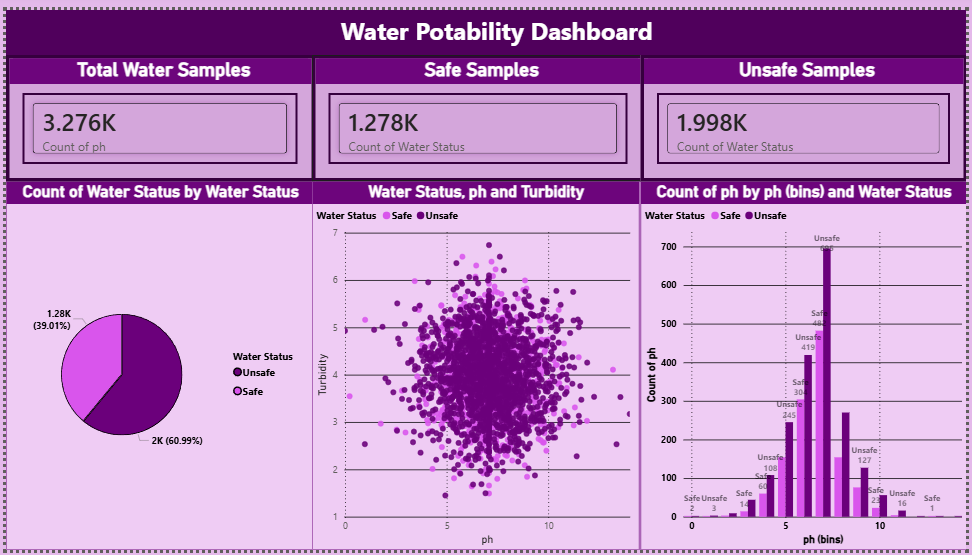
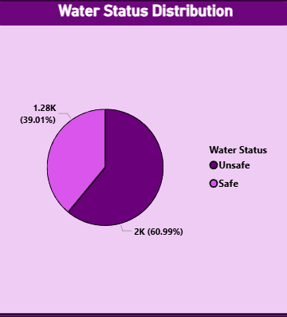
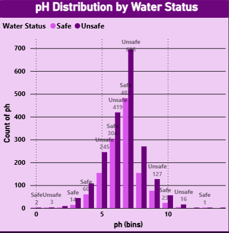

# 💧 Water Potability Analysis Dashboard

## 📌 Overview

This project analyzes water quality data using Power BI to determine whether water is safe for drinking.

---

## 🎯 Objectives

* Analyze dataset
* Identify safe vs unsafe water
* Study pH distribution
* Understand pH vs turbidity

---

## 📊 Dashboard

---

## 📈 Key Insights

* ~61% unsafe water
* pH mostly between 5–8
* Weak correlation

---

## 📷 Visualizations

### Water Status

### pH vs Turbidity

### pH Distribution

---

## 🛠 Tools Used

* Power BI
* CSV Dataset

---

